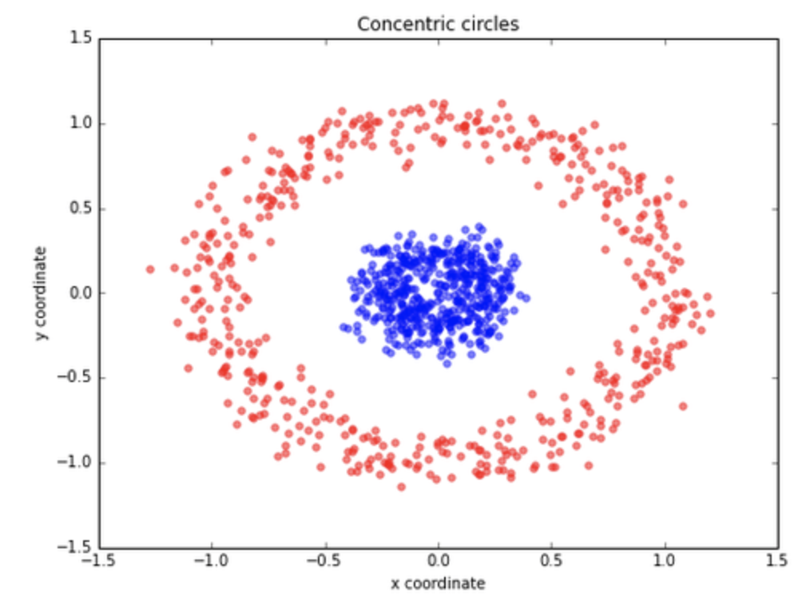
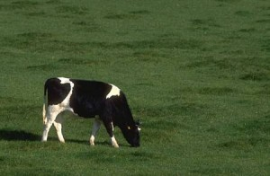
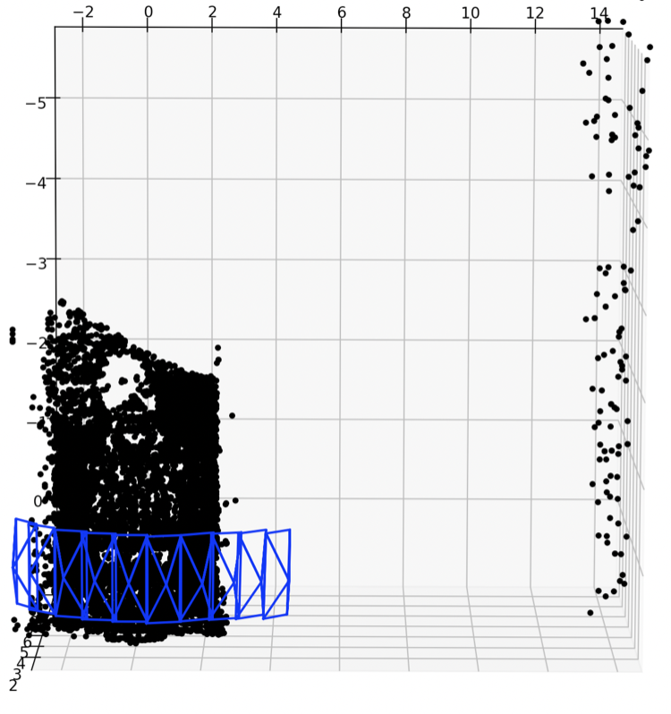
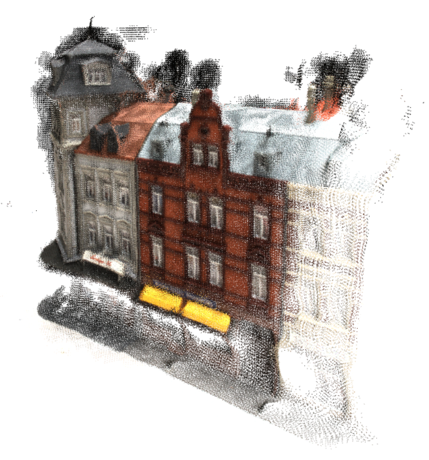
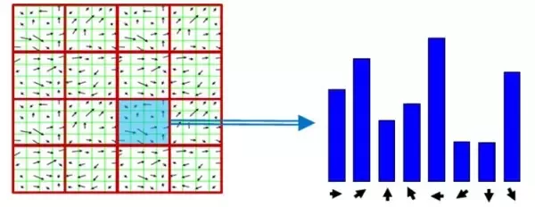
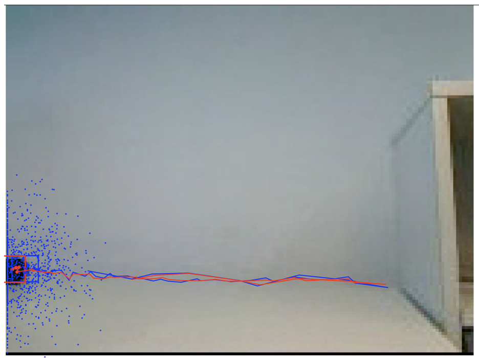

# Computer Vision
This repo contains the projects for the Computer Vision course at ETH Zurich. These projects assess a broad range of Computer Vision tasks: Image Classification, Image Segmentation, Camera Calibration, Structure From Motion, Multi-View-Stereo, Tracking. 

## Assignment 1
<table>
  <tr>
    <td>
      This assignment tests the basic understanding of simple Neural Network architectures (Multi-Layer-Perceptron and CNNs). It also helps familiarizing with PyTorch modules and framework. In the first of the two tasks, we are asked to classify points which are not linearly separable. We notice how the MLP outperrforms a simple linear classifier. In the second task, we are asked to implement a basic CNN network to classify the MNIST digits.
    </td>
    <td>
      
    </td>
  </tr>
</table>

## Assignment 2

<table>
  <tr>
    <td>
      This assignment is split into two parts. In the first one, we are asked to manually implement the Mean Shift unsupervised learning algorithm for image segmentation. In the second one, the goal was to built from scratch the SegNet architecture, both the encoder and the decoder structure.
    </td>
    <td>
      

         
      

      
    </td>
  </tr>
</table>

## Assignment 3

<table>
  <tr>
    <td>
      Assignement 3 tests the understanding of the principles of Camera Calibration and of the Strcture From Motion range imaging technique. In the first task, we first estimate the projection matrix P, with the Gold-Standard Algorithm. Then, using QR decomposition, we can obtain the intrinsic parameters of the calibration matrix and the extrinsic parameters: rotation matrix and translation vector. The second task consists in the development of a simple SFM algorithm, where we are asked to estimate successive camera poses with the triangulation technique.
   </td>
    <td>
      
    </td>
  </tr>
</table>

## Assignment 4
<table>
  <tr>
    <td>
      In the first task of the assignment, we implement the simple Ransac algorithm for model fitting (a 2D line). In the second task, we implement the  Patchmatchnet, (https://openaccess.thecvf.com/content/CVPR2021/papers/Wang_PatchmatchNet_Learned_Multi-View_Patchmatch_Stereo_CVPR_2021_paper.pdf), a novel and learnable cascade formulation of Patchmatch for high-resolution multi-view stereo.
   </td>
    <td>
      

        
      

    </td>
  </tr>
</table>

## Assignment 5
<table>
  <tr>
    <td>
      In the first task of the assignment, we implement a Bag-of-Word binary classifier, whose features are computed with the HoG descriptor. In the second task, we perform a multi-class image classification task on CIFAR-10 dataset by training a simple VGG network.
   </td>
    <td>
      

        
      

    </td>
  </tr>
</table>

## Assignment 6
<table>
  <tr>
    <td>
      The task consists in implementing a sampling consensation tracking algorithm based on color histograms, under the assumption of no motion and of constant velocity motion. Furthermore, we conduct a detailed analyis on the effect of each modelling hyperparameter.
   </td>
    <td>
      

        
      

    </td>
  </tr>
</table>
